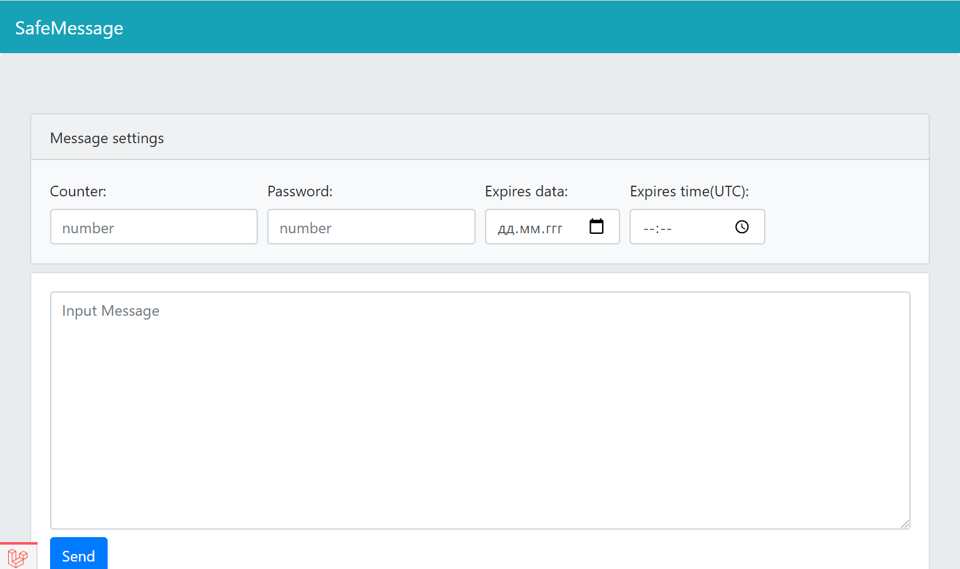
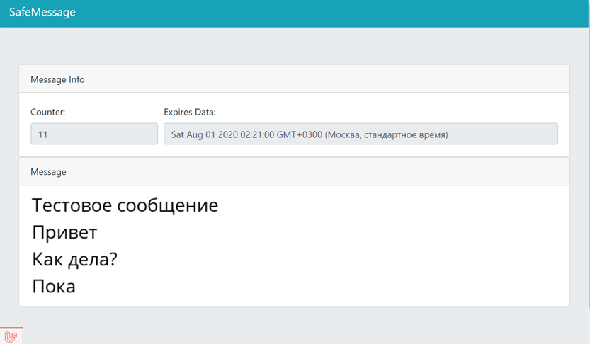
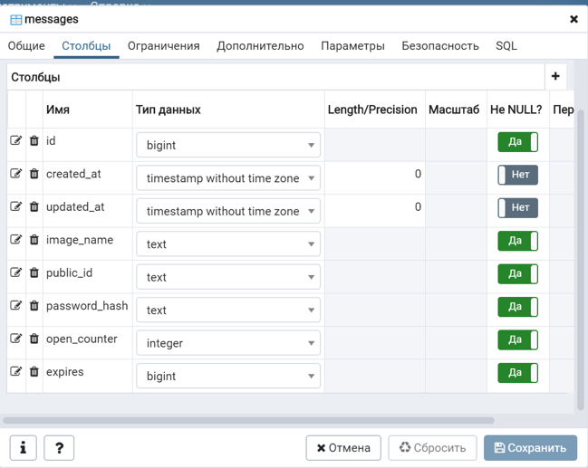

## О Проекте
`SafeMessage` - Сервис для обмена конфиденциальными сообщениями. 
Создан с использованием backend: `Laravel` и frontend: `React`.

## Интерфейс

## Функционал
Программа имеет поля: 
* `Password` - Пароль к сообщению
* `Date` - Дата и время, когда сообщение станет недоступно
* `Counter` - Количество открытий сообщения, после которого оно станет недоступно
* `Message` - Само сообщение

После отправки будет показано окно с паролем и ссылкой на защищенное сообщение.
При переходе по этой ссылке будет запрошен пароль.
Сообщение будет доступно определенное число раз до определенной даты.

## Модель базы данных
В проекте использовалась PostgreSQL

## Cерверная Часть
У сервера есть два маршрута с методом post `/api/message` и `/api/message/{id}`.
* Первый принимает данные из формы на главной странице программы и возвращает уникальный id этого сообщения.
* Второй маршрут в url принимает уникальный id, а в теле запроса принимает пароль.

## Защита Данных
* Фронтенд отправляет предварительно захэшированный пароль.
* На сервере пароль дополнительно хешируется с солью.
* В базе данных пароли хранятся в виде хешей полученных из конкатенации пароля и соли, которая хранится в переменной среды.
* При запросе на получение доступа к сообщению хеш от принятого пароля сверяется с хешом в бд.
* Сообщение возвращается на фронтенд в виде base64 строки,а после выводится.
* При запросе сообщения проверяется счетчик и дата сообщения в бд. 
Если счетчик равен нулю или дата просрочена, в ответ приходит ошибка и json в котором лежит сообщение об ошибке и идентификатор ошибки.

